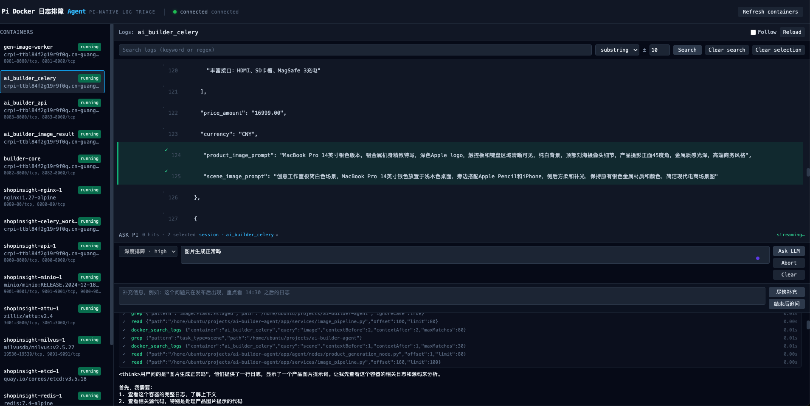
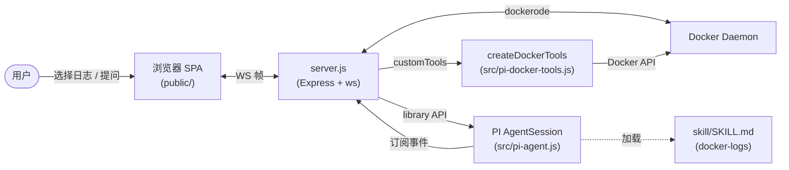
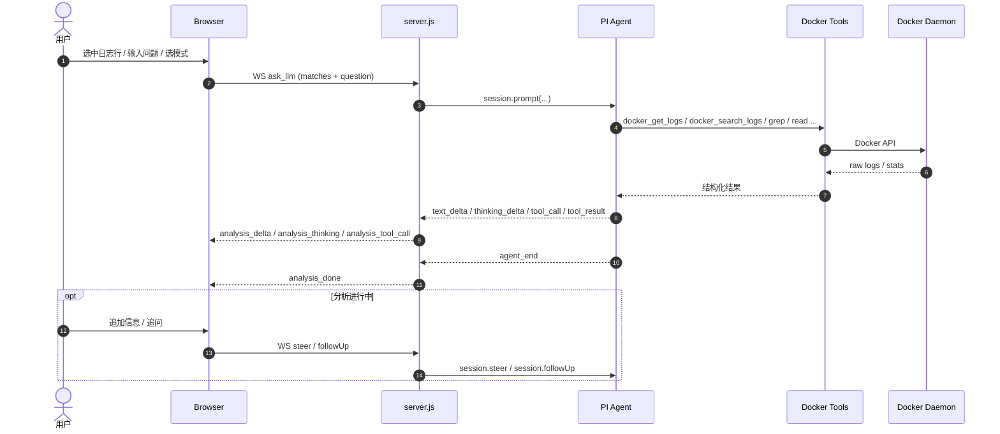

# Docker 日志排障 Agent

> 基于 PI（[@earendil-works/pi-coding-agent](https://pi.dev)）的 Docker 日志智能分析工具。
> 浏览器只负责呈现，PI Agent 负责推理；容器侧的全部操作都是只读、结构化的。

[](LICENSE)



---

## 目录

- [项目简介](#项目简介)
- [核心特性](#核心特性)
- [架构设计](#架构设计)
- [安装](#安装)
- [使用方法](#使用方法)
- [配置](#配置)
- [项目结构](#项目结构)
- [文档索引](#文档索引)
- [开发与测试](#开发与测试)
- [许可证](#许可证)

---

## 项目简介

传统 `docker logs` + `grep` 的排查路径有几个痛点：

- 命中行往往脱离上下文，需要手工拷贝前后若干行才能下判断；
- 排查一条链路（Nginx → 应用 → 队列 → DB）需要在多个容器间反复切窗口；
- 出了 `panic` / `OOM` 之类的根因，往往还得打开代码搜关键函数，路径割裂。

**Docker 日志排障 Agent** 把这些动作收敛到同一个浏览器面板：

- 左侧是 Docker 容器列表，中间是当前选中容器的日志流（行号、substring / regex 搜索、± 上下文高亮、`Follow` 模式）；
- 下方是 **ASK PI** 面板——把已经过滤好的命中行连同问题一起交给 PI Agent；
- PI Agent 通过只读工具回查更多日志、读取映射的源码仓库，**结合日志和代码给出可追溯的根因**。

整套工具调用经由 `tools: [...]` 白名单严格收敛，Agent 拿不到 `bash` / `edit` / `write`，容器状态只可能被查询，不可能被改动。

---

## 核心特性

- **PI-native Agent 循环**：推理、工具调用、自动重试全部交给 PI 框架，不在项目里造第二套状态机。
- **只读 Docker 工具**：四个结构化工具（`docker_list_containers` / `docker_get_logs` / `docker_search_logs` / `docker_get_stats`）经 JSON Schema 校验，不经过 shell。
- **双分析模式**：Quick（基于已有命中行直接回答） / Deep（结合代码 + 日志双证据强制追溯）。
- **增量追加信息**：分析进行中可以 `steer()` 追加补充信息、`followUp()` 排队下一个问题。
- **会话复用（Investigation）**：同一容器空闲窗口内复用同一 PI 会话，多轮排障保留历史。
- **跨容器代码映射**：通过 `config/projects.json` 把容器名绑定到源码仓库，PI 自动获得 `[source-repo]` 提示。
- **可作为 pi-package 分发**：把仓库发布到 npm，其他人 `pi install npm:docker-logs-agent` 即可获得完整 Skill。

---

## 架构设计

### 系统拓扑



- **Browser**：纯展示层，按行号渲染日志、收集用户提问、把 WS 帧翻译成面板状态。
- **server.js**：薄壳服务，对外暴露 HTTP / WS，对内调用 PI library + 包装 `DockerClient`。
- **PI Agent**：项目里不实现 Agent 循环——只负责创建会话、注册只读工具、把 SDK 事件转发到页面回调。
- **createDockerTools**：唯一接触 Docker 的地方，参数经 JSON Schema 校验，返回结构化结果。
- **skill/SKILL.md**：PI 的"说明书"，描述何时调用哪个工具、如何引用证据。

### "Ask LLM" 时序



### 组件职责对照

| 组件 | 文件 | 职责 | 不能做什么 |
|---|---|---|---|
| Browser SPA | `public/` | 渲染日志、收集提问、回显推理 | 不直接调 Docker |
| HTTP / WS | `src/http-routes.js`, `src/ws-router.js` | 协议转换、连接状态 | 不持有业务规则 |
| Docker 客户端 | `src/docker.js` | dockerode 封装 | 不做协议决策 |
| Docker 工具 | `src/pi-docker-tools.js` | JSON Schema 校验 + Docker API | 不做命令拼接 |
| PI 适配器 | `src/pi-agent.js` | 创建会话、注册工具、转发事件 | 不实现 Agent 循环 |
| Skill 说明书 | `skill/SKILL.md` | 描述何时/怎么调用工具 | **不参与权限控制** |
| 工具白名单 | `createAgentSession({ tools })` | 最终权限边界 | — |

> 权限边界 = 工具白名单。Skill 写得再严，"不要修改容器" 也不构成实际限制——会话创建时白名单里没有 `bash`，Agent 根本调不到。

---

## 安装

### 先决条件

| 依赖 | 版本 | 说明 |
|---|---|---|
| Node.js | ≥ 18 | 项目使用 `node --test`，无第三方测试框架 |
| Docker Engine | 任意 | 通过 `/var/run/docker.sock` 访问，默认权限即可 |
| PI 框架 | 由 `npm` 自动安装 | `@earendil-works/pi-coding-agent` |
| LLM 凭据 | — | Anthropic / OpenAI / 自定义 provider 都行，按 `PI_PROVIDER` 选 |

### 快速开始（一键）

```bash
git clone <this-repo>
cd docker-logs-agent
npm run setup          # 等价于：npm install + skill:link + setup-pi-auth + 启动
```

脚本会交互式要求填入 `PI_PROVIDER` / `PI_MODEL` / API Key，并把它们写入 `~/.pi/agent/models.json` 与 `~/.pi/agent/auth.json`（不会进 git）。

打开 <http://localhost:3000> 即可看到容器列表。

### 步骤详解

```bash
# 1. 安装依赖
npm install

# 2. 把 skill 软链进 PI 的全局 skills 目录
npm run skill:link    # 等价于：ln -sfn $PWD/skill ~/.pi/agent/skills/docker-logs

# 3. 配置 LLM 凭据（一次性）
./scripts/setup-pi-auth.sh

# 4. 启动服务（后台）
./scripts/restart.sh

# 或前台模式（Ctrl-C 退出）
npm start
```

### 卸载

```bash
npm run skill:unlink  # 删 ~/.pi/agent/skills/docker-logs 软链
```

---

## 使用方法

### 浏览器 UI

1. 左侧选容器 → 中间看日志；
2. 顶部搜索框支持 substring / regex、上下文 ± 行；
3. 勾选若干命中行（手动勾选也行），在下方 **ASK PI** 面板选模式 + 输入问题；
4. 点 **Ask LLM**，PI Agent 开始分析；过程可继续点 **尽快补充**（`steer`）或 **结束后追问**（`followUp`）。

### 分析模式

| 模式 | 思考等级 | 行为 |
|---|---|---|
| **Quick** | `thinkingLevel: low` | 优先基于已过滤日志直接作答，只在必要时才回查 |
| **Deep** | `thinkingLevel: high` | 必须结合"代码 + 日志"双证据，每条结论都要可追溯，禁止凭空捏造 |

两种模式都显式选择 `PI_PROVIDER` + `PI_MODEL` 配置的模型，**不在内存里改全局默认**。

### Standalone PI TUI（不使用浏览器）

安装完 `skill:link` 之后，也可以直接在 PI 命令行里用：

```bash
pi
> /skill:docker-logs
> why is my nginx container restarting?
```

> 注：独立 TUI 模式下没有 `createDockerTools` 注册，PI 只能依赖内置 `bash` + 系统 `docker` CLI；建议的"完整体验"还是用浏览器服务。

### 作为 pi-package 分发

仓库本身是合法的 [pi-package](https://pi.dev/docs/packages)。发布到 npm 后：

```bash
pi install npm:docker-logs-agent
```

会同时安装 Skill 与浏览器服务端。如果只想要 Skill，提取目录并 `pi install ./skill` 即可。

---

## 配置

通过环境变量配置；所有变量都有默认值，直接 `npm start` 即可运行。若需要自定义，在仓库根目录创建 `.env` 文件即可，`npm start` 会通过 Node 内置的 `--env-file-if-exists` 自动加载（`.env` 已被 `.gitignore` 忽略）：

| 变量 | 默认值 | 说明 |
|---|---|---|
| `PORT` | `3000` | HTTP / WS 端口 |
| `DOCKER_HOST` / `DOCKER_SOCKET_PATH` | `/var/run/docker.sock` | dockerode 连接目标 |
| `PI_PROVIDER` | `minimax` | PI provider，每个会话显式选择 |
| `PI_MODEL` | `MiniMax-M2.7` | PI 模型 |
| `PI_SUPPORTS_REASONING` | `1` | 仅在自定义模型不支持 thinking level 时设为 `0` |
| `PI_LOG_ARGS_MAX` | `160` | 工具调用参数在控制台日志与浏览器 trace 面板的截断长度 |

> PI 的推理 (`thinking_delta`) 与工具调用 (`analysis_tool_call` / `_tool_update` / `_tool_result`) **始终**实时回传到浏览器，不再受环境变量控制。

容器与源码仓库的映射写在 `config/projects.json`：

```json
{
  "ai-builder-celery": "/home/ubuntu/projects/ai-builder-agent",
  "shopinsight-api-1": "/home/ubuntu/projects/shopinsight"
}
```

PI 在分析对应容器时会收到 `[source-repo]` 提示，能用 `read` / `grep` / `find` 读源码而不需要 `bash`。

---

## 项目结构

```
docker-logs-agent/
├── package.json          # 依赖 + pi-package 清单 (pi.skills)
├── server.js             # Express + ws 入口
├── src/                  # 浏览器侧 Node 代码
│   ├── docker.js         # dockerode 封装 (listRunning/fetchLogs/followLogs)
│   ├── search.js         # substring / regex 搜索（含超时）
│   ├── http-routes.js    # /api/health, /api/containers, ...
│   ├── ws-router.js      # WS 消息分发 + 每连接状态
│   ├── pi-agent.js       # PI library 适配器 + 工具白名单
│   └── pi-docker-tools.js# 结构化只读 Docker 工具
├── public/               # 浏览器 SPA
│   ├── index.html
│   └── app.js
├── skill/                # PI Skill（也可作为 pi-package 安装）
│   └── SKILL.md          # 触发器 + 推荐流程 + 证据规范
├── config/
│   └── projects.json     # 容器名 → 源码仓库 映射
├── scripts/              # 项目本地脚本
│   ├── setup.sh
│   ├── setup-pi-auth.sh
│   ├── restart.sh
│   ├── stop.sh
│   ├── browser-smoke.js  # Playwright E2E
│   ├── ws-smoke.js
│   └── ws-follow.js
└── docs/
    ├── architecture/
    │   ├── architecture.md
    │   ├── browser-server.md
    │   └── projects-mapping.md
    └── code-explanation/
        ├── code-tour.md              # 首次阅读指引
        ├── pi-agent-explained.md
        ├── server-js-explained.md
        ├── ws-router-explained.md
        └── http-routes-explained.md
```

---

## 文档索引

| 你想知道 | 看哪里 |
|---|---|
| 第一次接触，从哪开始读 | [`docs/code-explanation/code-tour.md`](docs/code-explanation/code-tour.md) |
| 整套设计取舍 | [`docs/architecture/architecture.md`](docs/architecture/architecture.md) |
| WS 协议、每连接状态机 | [`docs/architecture/browser-server.md`](docs/architecture/browser-server.md) |
| PI library 适配器 & 工具白名单 | [`docs/code-explanation/pi-agent-explained.md`](docs/code-explanation/pi-agent-explained.md) |
| 容器 ↔ 源码仓库映射怎么生效 | [`docs/architecture/projects-mapping.md`](docs/architecture/projects-mapping.md) |
| `server.js` 怎么把环境串起来 | [`docs/code-explanation/server-js-explained.md`](docs/code-explanation/server-js-explained.md) |
| WS 路由的事件分发细节 | [`docs/code-explanation/ws-router-explained.md`](docs/code-explanation/ws-router-explained.md) |
| HTTP 路由 | [`docs/code-explanation/http-routes-explained.md`](docs/code-explanation/http-routes-explained.md) |

---

## 开发与测试

```bash
npm test                # node --test，全部 33 个用例
```

测试覆盖：

- 只注册四个 Docker 工具，且 `bash` / `write` / `edit` 永远不在白名单内；
- 日志工具返回的 `[Ln]` 行号格式稳定；
- 搜索工具复用项目内的 `src/search.js`，带超时；
- 浏览器提示词只引导 PI 使用结构化工具，不出现 `.sh` 之类的 shell 路径；
- WS 协议事件（`analysis_delta` / `analysis_tool_call` / `analysis_done` 等）按顺序发且不丢；
- Investigation 会话复用窗口、busy 状态、steer / followUp 时序。

修改 `src/pi-agent.js` / `src/ws-router.js` / `server.js` 之后**必须重启服务**（`./scripts/restart.sh`），Node 不会 hot-reload 子模块。修改 `skill/SKILL.md` 后重新发一次提问即可（每次提问都新建 PI 会话，会重新加载最新 Skill）。

---

## 许可证

本项目基于 [zlib 许可证](LICENSE) 开源，Copyright © 2026 vitochen。允许用于任意目的（包括商业用途），但禁止冒名原作者或冒充原版。完整条款见 `LICENSE` 文件。